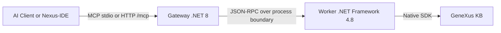

# GeneXus MCP Server — GeneXus 18 for Claude, Cursor, and AI Agents

[](https://www.npmjs.com/package/genexus-mcp)
[](https://www.npmjs.com/package/genexus-mcp)
[](https://lobehub.com/mcp/lennix1337-genexus18mcp)
[](https://opensource.org/licenses/MIT)
[](https://safeskill.dev/scan/lennix1337-genexus18mcp)

**GeneXus MCP Server** is a Model Context Protocol (MCP) server that exposes a GeneXus 18 knowledge base to AI agents — Claude Desktop, Claude Code, Cursor, and any MCP-compatible client. It lets the agent read, edit, analyze, and refactor GeneXus objects (transactions, web panels, procedures, SDTs, data providers) directly through the native GeneXus SDK, with a .NET 8 gateway over MCP/stdio and a .NET Framework 4.8 worker hosting the SDK.

> **Search keywords:** GeneXus MCP · GeneXus 18 MCP · GeneXus AI · GeneXus Claude · Model Context Protocol GeneXus · GeneXus low-code AI agent

***

## 🚀 Quick Start (Installation & Configuration)

You **do NOT** need to clone this repository, and you **do NOT** need to install anything globally via `npm i -g`. The standard Node.js `npx` runner will dynamically fetch and launch the compiled gateway for you.

### Step 1: Configure (Non-Interactive First)

To initialize configuration in a deterministic, agent-friendly way:

```bash
npx genexus-mcp@latest init --kb "C:\KBs\YourKB" --gx "C:\Program Files (x86)\GeneXus\GeneXus18"
```

If you want the setup wizard prompts explicitly, run:

```bash
npx genexus-mcp@latest init --interactive
```

### Step 2: Restart your AI Assistant

Once the wizard outputs `🎉 You are all set!`, simply **Restart** or **Refresh** your AI Assistant (Claude Desktop, Antigravity, Cursor, etc.). The AI will automatically spin up the server in the background and connect.

---

### 🤖 Auto-Installer Prompt (Copy & Paste to your AI)

If you want your AI Assistant to install and configure everything itself without you touching the terminal, copy and paste this exact prompt into your chat window:

```markdown
Please configure your Model Context Protocol (MCP) server to connect to my GeneXus Knowledge Base by following these exact steps:

1. Run the command `npx genexus-mcp@latest init` directly in the terminal in non-interactive mode using this configuration format (do not use interactive prompts). You must inject my raw KB path and GX path via environment variables or a direct config patch if needed, or simply let the zero-config auto-discovery handle it if we are already in the KB folder.
2. If I haven't told you my GeneXus path or KB path, STOP and ask me for them now.
3. Once the setup is complete, read the generated JSON block from the console output.
4. If you use a global configuration file (like `mcp_config.json` or `claude_desktop_config.json`), insert the exact `mcpServers` block provided in the console output. Use `npx.cmd` as the command.
5. Provide a summary of the installation and notify me when you are ready to query GeneXus!
```

---

## AXI CLI Commands

The package now includes agent-facing commands optimized for shell automation:

```bash
genexus-mcp home
genexus-mcp axi home
genexus-mcp llm help
genexus-mcp status
genexus-mcp doctor --mcp-smoke
genexus-mcp tools list
genexus-mcp config show
genexus-mcp layout status
genexus-mcp layout run --action activate-layout
genexus-mcp layout run --action activate-tab --tab "Layout"
genexus-mcp layout inspect --tab "Layout"
```

Global AXI flags:
- `--format toon|json|text` (default for AXI commands: `toon`)
- `--fields f1,f2,...` (minimal schema by default; request extra fields explicitly)
- `--limit <n>` (for list commands)
- `--query <text>` (for `tools list`)
- `--full` (expand truncated long-form content when supported)
- `--mcp-smoke` (for `doctor`; executes protocol smoke checks)
- `--quiet` and `--no-color` (agent-safe output control)

Layout automation flags (`layout run`):
- `--action focus|activate-layout|activate-tab|send-keys|type-text|click`
- `--title "<window-title-fragment>"` to target a specific GeneXus window
- `--tab "<tab-name>"` for `activate-tab`
- `--keys "<sendkeys-pattern>"` for `send-keys`
- `--text "<text>"` for `type-text`
- `--x <screenX> --y <screenY>` for `click`

Layout inspection:
- `genexus-mcp layout inspect [--tab "<tab-name>"] [--limit N] [--full] [--title "<window-title-fragment>"]`
- Returns UI Automation controls with bounding rectangles (`bounds.x/y/width/height`) to support deterministic replay.

Notes:
- Structured data/errors are emitted on `stdout`.
- Diagnostic/progress output stays on `stderr`.
- `meta.command` is always present for stable command identity in AXI outputs.
- Use `genexus-mcp <command> --help` for command-specific usage/examples.
- Output metadata includes `meta.schemaVersion` for contract stability.
- `--fields` is validated strictly per command; invalid fields return `usage_error` and exit code `2`.
- Running `genexus-mcp` without an AXI subcommand keeps the original MCP gateway launcher behavior.
- `genexus-mcp home` (`genexus-mcp axi home`) is the explicit content-first AXI entrypoint.
- `genexus-mcp llm help` returns protocol-first usage guidance for agents.
- Full LLM-facing AXI contract: [`docs/axi_cli_contract.md`](docs/axi_cli_contract.md)
- LLM usage playbook (CLI + MCP best practices): [`docs/llm_cli_mcp_playbook.md`](docs/llm_cli_mcp_playbook.md)

---

## 🛠️ Tool Surface (Skills)
*(See `GEMINI.md` for extended guidelines).* The worker natively exposes the following tools to the MCP Router:

- **Search & Discovery**: `genexus_query`, `genexus_read`, `genexus_inspect`, `genexus_list_objects`, `genexus_properties`
- **Editing & Architecture**: `genexus_edit`, `genexus_create_object`, `genexus_refactor`, `genexus_forge`
- **Analysis:** `genexus_analyze`, `genexus_inject_context`, `genexus_doc`, `genexus_explain_code`, `genexus_summarize`
- **File System & Assets**: `genexus_asset`, `genexus_export_object`, `genexus_import_object`
- **History & DB**: `genexus_history`, `genexus_get_sql`, `genexus_structure`
- **Native Layout SDK**: `genexus_layout` (`get_tree`, `find_controls`, `set_property`, `set_properties`, `rename_printblock`, `add_printblock`, `get_preview`, `scan_mutators`)

> **`genexus_edit` modes:** `xml` (default — full XML replacement), `ops` (typed semantic op catalog: `set_attribute`, `add_attribute`, `remove_attribute`, `add_rule`, `remove_rule`, `set_property`), `patch` (JSON-Patch RFC 6902 array over canonical JSON object; legacy string-form patch also accepted for backward compatibility).
>
> **All write tools** accept `dryRun: true` (returns a preview `plan` envelope without mutating the KB) and `idempotencyKey` (safe retries — concurrent calls with same key are coalesced; results cached for 15 min by default).

Layout color note:
- For `ForeColor`, `BackColor`, `BorderColor`, send color values as palette names (`Black`, `Blue`, `Red`, `Transparent`) or RGB token (`R; G; B|`) to avoid nested SDK wrappers.
- **Lifecycle & Build**: `genexus_lifecycle`, `genexus_test`, `genexus_format`
- **Patterns**: Smart XML generation and interpretation (e.g., WorkWithPlus PatternInstance mapping).

### MCP tool response ergonomics

For `tools/call`, the gateway keeps MCP compatibility and adds lightweight response metadata:

- `_meta.schemaVersion` currently `mcp-axi/2`
- `_meta.tool` with the normalized tool name
- collection helpers such as `returned`, `total`, `empty`, and (when inferable) `hasMore` and `nextOffset`
- truncation signals via `_meta.truncated` plus contextual `help`
- `_meta.idempotent: true` on cache-hit responses
- `_meta.batched: true` on `targets[]` multi-object responses
- `_meta.dryRun: true` on dry-run preview responses
- `_meta.removedTools` advertised on `initialize` for proactive agent detection of removed tools

For list-heavy calls (`genexus_query`, `genexus_list_objects`), optional arguments can reduce token usage:

- `fields`: explicit projection (`["name","type"]` or `"name,type"`)
- `axiCompact: true`: compact default projection

Timeout behavior for long-running MCP tools:
- Gateway may return `result.isError=true` with `status=Running` plus `operationId`/`correlationId`.
- In this case, do not fail fast. Continue with `genexus_lifecycle(action='status'|'result', target='op:<operationId>')`.

---

## 💻 Development & Building from Source

If you want to contribute, build the project yourself, or use the local **Nexus-IDE** VS Code Extension, use the classic source-based workflow.

### Automated Release (npm + GitHub)
- Workflow: `.github/workflows/release.yml`
- Trigger: `push` na `main` com mudança em `package.json`
- Behavior:
- compara a versão atual com a versão do commit anterior
- publica no npm apenas se a versão for nova
- cria GitHub Release com tag `v<version>`
- Required secret:
- `NPM_TOKEN` (token de publicação no npm com permissão para o pacote `genexus-mcp`)

### One-Click Build
1. Clone the repository to your Windows machine.
2. Run `.\setup.bat`.
   * *This checks prerequisites, builds the C# components, and auto-registers the local server with Claude, Codex, Antigravity, and Cursor when detected.*
3. If GeneXus or your KB are not auto-detected, follow the terminal prompts.

### Nexus-IDE (VS Code)
The repository includes `src/nexus-ide`, a lightweight VS Code extension containing:
- Virtual file system using the `genexus://` scheme
- Dynamic KB explorer with multi-part editing (Source, Rules, Events, Variables)
- Built-in MCP discovery commands (tools, resources, prompts)

### Advanced Configuration
You can expand your local `config.json` for advanced networking or timeouts:

```json
{
  "Server": {
    "HttpPort": 5000,
    "BindAddress": "127.0.0.1",
    "SessionIdleTimeoutMinutes": 10,
    "WorkerIdleTimeoutMinutes": 5
  },
  "GeneXus": {
    "InstallationPath": "C:\\Program Files (x86)\\GeneXus\\GeneXus18",
    "WorkerExecutable": "worker\\GxMcp.Worker.exe"
  },
  "Environment": {
    "KBPath": "C:\\KBs\\YourKB"
  }
}
```

### Process Lifecycle & Architecture
- **Lazy Worker Mapping:** The .NET 8 Gateway is resident, but the heavy .NET 4.8 Worker is lazy (only spins up when the first standard command is received) and automatically terminates after `Server.WorkerIdleTimeoutMinutes` of inactivity to unlock build artifacts.
- **Gateway Reuse**: Launching multiple local IDE instances reuses a single active gateway using a unique lease file located at `%LOCALAPPDATA%\GenexusMCP\gateway-leases`.
- **HTTP Mode**: Run via HTTP at `http://127.0.0.1:5000/mcp` (Supports SSE notifications alongside standard POST JSON-RPC). Protocol expects `MCP-Protocol-Version: 2025-06-18`.


