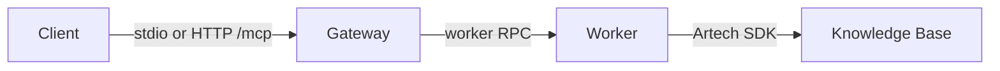

# GeneXus MCP Technical Architecture

This document describes the current runtime architecture. It is not a historical roadmap.

## Runtime model

The system uses a dual-process design:

- `GxMcp.Gateway` on .NET 10 owns the MCP protocol surface.
- `GxMcp.Worker` on .NET Framework 4.8 owns GeneXus SDK execution.

## Transport

### Official transports

- stdio MCP
- HTTP MCP at `/mcp`

### HTTP behavior

- Legacy clients use `initialize` and `MCP-Session-Id` with the negotiated
  `2025-11-25` contract.
- Modern clients may use `2026-07-28` per-request metadata and
  `server/discover`; they do not share a server-side KB selection.
- Session-aware HTTP uses `MCP-Session-Id`; sessionless requests must carry an
  explicit `kb` or use the persisted fallback.
- Loopback `/mcp` requests accept only `localhost`, loopback literals, or the
  configured loopback bind in `Host`; this closes the browser DNS-rebinding
  path while preserving token-protected non-loopback binds.
- `GET /mcp` is used for SSE notifications.
- `DELETE /mcp` closes the session.

Modern `2026-07-28` clients can open `subscriptions/listen` with a POST
request. The response is a bounded SSE stream whose first message is
`notifications/subscriptions/acknowledged`; the client opts into tool/resource
list changes and exact resource URIs in `params.notifications`. Each stream has
its own random subscription handle, a bounded queue, a keepalive, and cleanup on
disconnect. Legacy `resources/subscribe` remains session-scoped and is not
accepted on the sessionless path. Resource notifications retain the legacy `uri`
for compatibility and add `kbAlias`, `cacheRevision`, and a KB-qualified
`resourceUri`; clients that have multiple KBs open can subscribe to the scoped
URI without conflating same-named objects, and `resources/read` resolves that
scoped URI back to the explicit KB before dispatching to the Worker.

The `io.modelcontextprotocol/tasks` extension is advertised by
`server/discover`. Modern task requests must opt in through
`params._meta.io.modelcontextprotocol/clientCapabilities.extensions`; legacy
session clients remain backward compatible. On sessionless HTTP, task callers
must also send a stable `Mcp-Client-Id` header; requests without that explicit
scope fail closed before looking up a task. Task handles (`tasks/get`,
`tasks/update`, and `tasks/cancel`) are scoped to the transport identity that
created the background job. Asynchronous `tools/call` responses use
`resultType:"task"`; polling uses `resultType:"complete"`, while update and
cancel return empty acknowledgements. Modern task status values map to the MCP
extension states, and terminal tasks reject cancellation. A cancellation
notification still matches the exact JSON-RPC id token, so numeric `1` and
string `"1"` remain separate requests.

Worker progress frames use a private Gateway operation id for correlation, then
restore the original client `progressToken` before delivery. They are routed
only to the originating stdio or legacy HTTP session; the sessionless modern
POST path does not broadcast unsolicited progress between clients. A modern
`notifications/cancelled` POST is accepted as a no-op because that transport
has no prior stream identity; clients cancel by closing the response stream.

### KB lifecycle build modes

`genexus_lifecycle action=build` remains the directed or incremental build
contract, while `action=rebuild` remains the forced Rebuild All contract.
`action=build_all` is an explicit KB-global incremental Build All: it omits
`target`, invokes the SDK `BuildAll` task in-process when the installed
GeneXus version exposes it, and otherwise runs an equivalent temporary MSBuild
project with `ForceRebuild=false`. Both paths set `FailIfReorg=true` and
`DoNotExecuteReorg=true`; a required schema reorganization terminates as
`ReorgRequired` with a retry hint instead of changing the database implicitly.
Terminal results include `buildMode`, `kbOpened`, `buildAllDone`,
`reorgRequired`, `msBuildExitCode`, and `fullLogPath`, and a zero exit code is
not accepted as completion evidence by itself.

## Discovery-first surface

Clients are expected to discover capabilities dynamically:

- `tools/list`
- `resources/list`
- `resources/templates/list`
- `prompts/list`
- `completion/complete`

The extension uses this MCP discovery flow directly.

## Worker responsibilities

- Open and manage the active KB
- Read and write object parts
- Execute analysis, refactor, formatting, lifecycle, history, structure, and property operations
- Isolate GeneXus runtime constraints from the gateway process

All SDK-touching watcher actions are admitted through the existing STA bridge
with a bounded `SdkExecutor`. Reentrant calls execute inline on the owner thread;
calls that arrive while the admission budget is full receive a typed busy result.
Pure response shaping remains outside the SDK thread.

### Text patch responsibilities

The `genexus_edit mode=patch` implementation keeps its external contract in
`PatchService`, but separates deterministic work from SDK side effects:

- `PatchTextEditor` owns pure context matching, Replace, InsertAfter, fuzzy
  matching, diagnostics, and edit-distance calculations.
- `PatchService` orchestrates snapshots, optimistic concurrency, the single
  write attempt, forced post-save reads, cache invalidation, and rollback.
- `PatchPersistenceReceipt` builds the stable persistence evidence (`saved`,
  `verified`, hashes, old-context presence, and rollback status).
- `TextPersistenceVerifier` owns exact, normalized, and semantic equivalence.
- `CommentOnlyPatch` classifies line/block comment replacements and counts the
  previous statement only when it remains active outside comments or strings.

For Source/Rules, `exact` compares every logical character while treating CRLF
and LF as equivalent SDK renderings. This prevents a persisted comment from
being rolled back solely because U16 returned a different line-ending style.
Comment-only writes require `baseVersion`; a divergent forced re-read returns
`CommentOnlyWriteNotPersisted`, and an explicitly requested rollback restores
and verifies the pre-write snapshot.

These boundaries are internal. Refactoring them must preserve tool arguments,
write count, transaction behavior, and the prohibition on implicit KB lifecycle
actions. New typed failure codes may be added only when they replace an
ambiguous or false-success result without changing the write semantics.

## Gateway responsibilities

- MCP routing
- HTTP session lifecycle
- Worker lifecycle and restart boundaries
- Dynamic tool publication from `tool_definitions.json`
- Resource, prompt, and completion exposure
- `genexus://kb/capabilities` is a stable resource URI whose contents are
  fetched from the explicit, read-only SDK capability probe for the selected
  KB; tools/list remains deterministic and never hides tools per session.
- Legacy HTTP sessions may subscribe to a resource URI. Subscription state is
  private to the creating session and `notifications/resources/updated` is
  filtered before entering its SSE queue; the sessionless 2026 transport does
  not accept the legacy subscription methods without a negotiated stream.
- Task-handle projection over the session-scoped background job registry
- Additive response normalization for `tools/call` payloads (`mcp-axi/2` metadata under `_meta` and lightweight aggregates)
- Canonical operation policy for cache/idempotency decisions: published
  actions and legacy aliases are normalized through `ToolIdentity` and
  `OperationClassifier`; unclassified operations remain fail-closed and use
  the compatibility path until their contract is added.

Gateway latency summaries are bounded and aggregate-only. Each completed or
timed-out call records the canonical tool, result class, end-to-end duration,
queue wait, SDK dispatch time, gateway transformation/serialization time, cache
outcome, and response byte count; p50/p95 values are retained in memory and no
KB content, object names, paths, or request IDs enter the metric labels. The
Gateway also exposes the opt-in `Genexus.Mcp.Gateway` `ActivitySource` and
`Meter` (`genexus_mcp_tool_calls` and `genexus_mcp_tool_duration_ms`); without
an external listener they produce no spans or network traffic.

Semantic reads use a bounded cache keyed by the normalized KB, canonicalized
arguments, and (when available) the active model/environment identity. Each KB
has an independent generation. A confirmed or uncertain mutation advances only
that generation and evicts its entries; a read that started in an older
generation cannot repopulate it after the mutation. Entry freshness uses an
absolute TTL independent from LRU access time, so repeated hits cannot keep a
stale answer alive forever. Preview/validate-only operations do not invalidate
the generation.

The `genexus_analyze` `mode=context` path applies a bounded context bundle after
SDK resolution. The bundle hashes the complete result, keeps JSON item
boundaries intact, pages large collections with a continuation cursor, and
turns oversized object parts into `genexus://objects/{name}/part/{part}` read
references. A partial page reports its omitted sections and budget so an agent
can continue deliberately instead of guessing what was cut.

Direct caller/callee lookups use a derived adjacency snapshot in the Worker.
The snapshot combines SDK `Calls`/`CalledBy` edges with the indexed textual
fallback once per `SearchIndex.GraphRevision`; subsequent graph reads only copy
the requested node's sorted degree list. Mutations and edge enrichment advance
the revision, while the revision itself remains in-memory derived state and is
never written to the on-disk index.

Rename fallbacks use the same graph signals for preview, then rewrite only
identifier tokens in source parts. The tokenizer excludes line/block comments,
quoted strings, and larger identifiers, and previews report the graph revision
plus source/line/column evidence. A native SDK refactor remains preferred when a
future capability probe proves its semantics.

## Tool call response contract (gateway-normalized)

For MCP `tools/call`, the gateway returns standard MCP `content[].text`, but normalizes JSON payloads with additive metadata:

- `_meta.schemaVersion = "mcp-axi/2"` (v2.0.0; field is underscore-prefixed per MCP convention)
- `_meta.tool = <tool-name>`
- collection helpers when inferable: `returned`, `total`, `empty`, `hasMore`, `nextOffset`
- truncation hints: `_meta.truncated=true` plus actionable `help` message
- v2.0.0 fields: `_meta.idempotent` (cache hit), `_meta.batched` (`targets[]`), `_meta.dryRun` (preview), `_meta.removedTools` (advertised on `initialize`)
- idempotent marker: `noChange=true` when the worker reports successful no-op

Compatibility rules:

- Existing worker fields are preserved.
- Enrichment is additive and does not change no-args launcher behavior.
- Clients that ignore new fields remain compatible.

## Design constraints

- New features should target MCP tools, resources, prompts, or completion endpoints.
- New extension flows must only target MCP contracts.
- Resource reads should be preferred for stable browsable context.
- Large object reads should be paginated with `genexus_read` or coordinated with `genexus_read(targets=[...])` (plural form, v2.0.0+; the legacy `genexus_batch_read` was removed).
